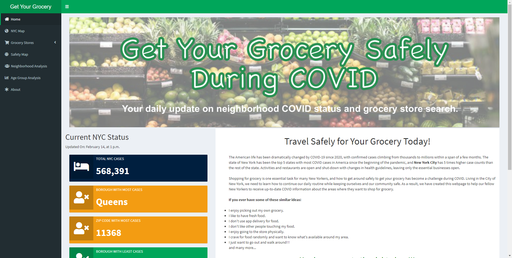
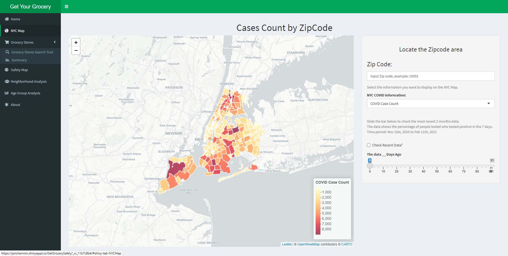
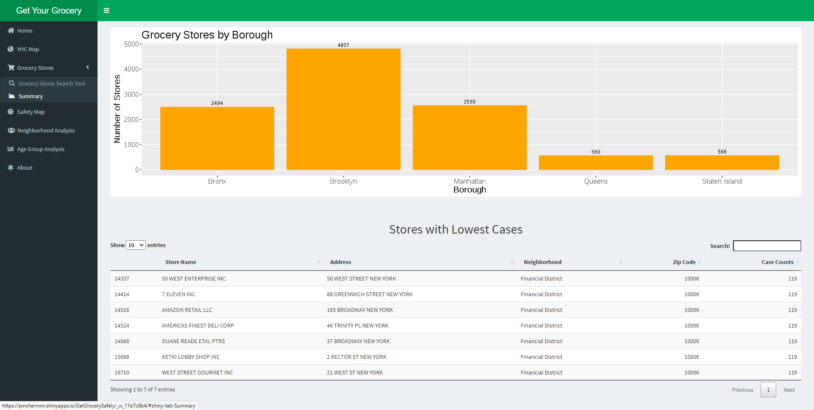
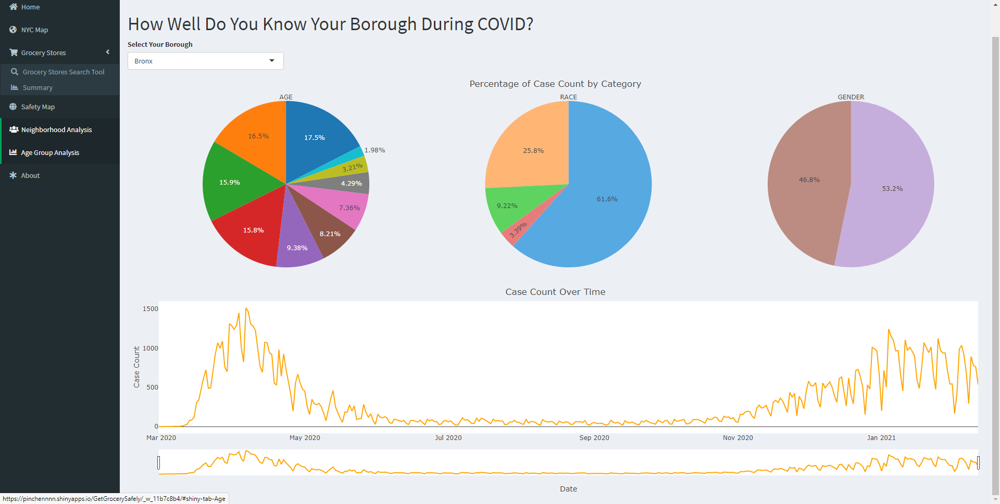
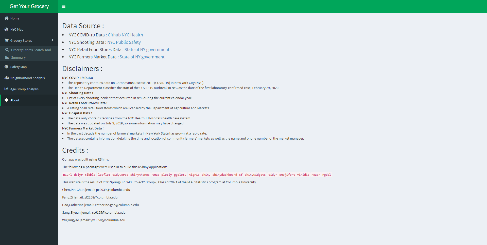

# Project 2: Shiny App Development

### [Project Description](doc/project2_desc.md)







## NYC Grocery Shopping Under COVID-19 

Shiny app link:https://pinchennnn.shinyapps.io/GetGrocerySafely/

Term: Spring 2021

+ Team: Group 2
+ + **Project title**: NYC travel safe map for grocery
+ Team Members:          
	+ Pin-Chun Chen
	+ Zi Fang
	+ Catherine Gao
	+ Siyuan Sang
	+ Yingyao Wu

+ **Project summary**: Shopping for grocery is one essential task for many New Yorkers, and how to get around safely to get your grocery has become a challenge during COVID. Living in the City of New York, we need to learn how to continue our daily routine while keeping ourselves and our community safe. As a result, we have created this webpage to help our fellow New Yorkers to receive up-to-date COVID information about the areas where they want to shop for grocery. Our app also offers the map of shooting incidents in NYC to help the users to design their route towards the shops. Besides, we also offer an up-to-date vitualization of COVID-19 data from nyc health department. At the end of our project, we also express our worry that potential survivor bias can lead to an underestimate of how the old people in NYC suffered during the COVID-19.  

+ **Contribution statement**: 
All of the groups members did great contibutions to the project.

All five members work together on looking for the suitable datasets for the map and the analysis. And all team members participated in the dicussion of project topic and actively put forward their own ideas.

Zi Fang cleaned and grouped data for NYC coronavirus cases and NYPD shooting cases and worked on building a map. She generated the idea of concerning app users' safety issues on their way to the target grocery store besides finding the store. She created the safety map tab by creating a map to indicate precise shooting incident locations and creating an interactive pie chart to show the percentage of shooting incidents in each borough. She is also the presenter of the grocery store shiny app.

Catherine Gao created the basic framework by designing the UI, theme, and segmentation of the webpage. She created the Home tab by adding informative COVID status trackers, designing the header banner, and crafting the introduction message to users. She also developed the Neighborhood Analysis tab by using interactive pie charts to show the percentage of cases by different classifications.

Siyuan Sang cleaned and grouped data for NYC coronavirus cases. He created the age group analysis tab by vitualizing the counts and rates of COVID-19 data and showed some evidences of the "survivor bias" that could exist among the aged group. He generated the data references and created the data source tab. And he summarized the whole idea of the project and wrote the project README on the Github.

All team members approve our work presented in this GitHub repository including this contributions statement. 

Following [suggestions](http://nicercode.github.io/blog/2013-04-05-projects/) by [RICH FITZJOHN](http://nicercode.github.io/about/#Team) (@richfitz). This folder is orgarnized as follows.

```
proj/
├── app/
├── lib/
├── data/
├── doc/
└── output/
```

Please see each subfolder for a README file.

